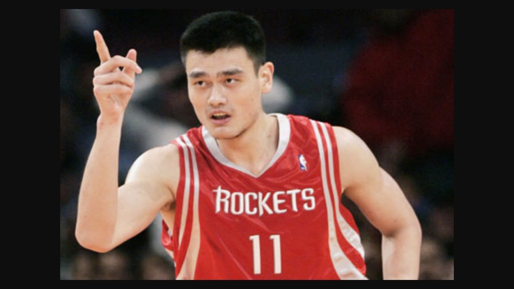

```{r setup, echo = FALSE, include = FALSE}
#####################
### Package setup ###
#####################

knitr::opts_chunk$set(echo = FALSE, fig.pos = 'H')
library(tidyverse)
library(stringr)
library(curl)
library(jsonlite)
library(data.table)
library(knitr)
library(httr)
library(kableExtra)
theme_set(theme_minimal())
```


## Introduction

This project uses NBA stats from balldontlie API to evaluate a former Chinese NBA player, Yao Ming, who played for the Shanghai Sharks of the Chinese Basketball Association (CBA) and the Houston Rockets of the National Basketball Association (NBA).  

He is praised by the following statements from hoophall.com, which has the basketball Hall of Fame: 

- *"Already a legend in his native China, the big center was poised to test his mettle against the best basketball players in the world. In eight NBA seasons, Yao made eight All-Star rosters, averaged 19 points and 9 rebounds, and was named to the All-NBA team five times. He was also a three-time gold medalist and three-time MVP at the FIBA Asia Championships.".* 

Since Yao is one of the few Chinese players who played for NBA teams, I am interested to explore some of his performance during NBA seasons and make some analyses.  

<p> 
{width=400px}  
</p> 

\pagebreak  

Interestingly, Yao is also famous for his meme:  
{width=150px}

## Source of Data
The data this assignment uses is accessed from [balldontlie API (NBA stats)](http://www.balldontlie.io/#introduction), which offers free API to access NBA related data (No API key required. Amazing isn't it). But in order to retrieve data from the website, it still requires the user to write API queries to access data, which I wrote in part2 Rmd.

```{r get nba data, include = FALSE}
#########################
### write API queries ###
#########################
nbaGet <- function(id, date, page){
  baseurl <- "https://www.balldontlie.io/api/v1/stats?"
  params <- c("player_ids[]=", "start_date=", "page=")
  values <- c(id, date, page)
  param_values <- map2_chr(params, values, str_c)
  args <- str_c(param_values, collapse = "&")
  str_c(baseurl, args)
}
```

## Data selection
The data contains many aspects of the player's related information, such as personal information, his team's information, games he played and etc. For this assignment, to better evaluate the player's performance, I only selected the data related to the games the player played. Notice that I did not use all of the variables I selected either, because considering that Yao's position is center, which I think only a few of variables here can be used to evaluate his performance. But if you want to explore more of other player's performance who has different position, these variables are pretty handy. You can refer to the end of this assignment where I offer an index table of basketball terms. The variables I selected are:

```{r iterative expression, include = FALSE}
################################
### Get web data and tidy it ###
################################

# create an empty dataframe
yao_data <- data.frame()

for (i in seq(22)){ # there are 22 pages for this player
  # Get nba player Ming Yao's data
  yao_nba <- nbaGet(1445, "1997-01-01", i) # Yao's career starts from 1997
  yao_info <- content(GET(yao_nba), as = "parsed", type = "application/json") 
  # convert web content to a matrix 
  yao_matrix <- do.call(rbind, yao_info$data)
  yao_matrix <- replace(yao_matrix, yao_matrix=="NULL", NA)
 
  # convert matrix to a dataframe
  yao_df <- data.frame(yao_matrix[,1:14]) # we only need these columns 
  names(yao_df)[names(yao_df)=='id'] <- 'id_player' # change column name to avoid duplicate names
  # iteration to widen all list columns
  for (i in colnames(yao_df)){
    if(class(yao_df[i][[1]]) == 'list') { # check if the first column is a list column
      yao_df <- unnest_wider(yao_df, i)  
      names(yao_df)[names(yao_df)=='...1'] <- i  # avoid duplicate column names
    }
    if(i %like% "game.") { # make sure the dataframe from each page has the same column names to allow rbind()
      names(yao_df)[names(yao_df)==i] <- substr(i, 6, 1000)  
    }
  }
  yao_data = rbind(yao_data, yao_df) 
}
yao_data
```


## How was Yao's performance?

Since Yao's position was center, I consider Defensive Rebound, Assist, Block, Field goal percentage (FG%), and Free throw percentage (FT%) as four important indicators of a center's performance. Please correct me if I were wrong, since I am not a big fan of NBA. :)  
The following table shows the average and max value of each indicators, splitted by either winning the game or losing the game (please check previous Index Table for details). From the table we can see that overall Yao has a stable performance in both winned games and lost games, and he contributes more in winned games. Since centers are the big man, Yao get rebounds and play low post and has a higher FG% than all the other positions. According to wikipedia, in basketball, a FG% of .500 (50%) or above is considered a good percentage. Yao here definitely performs well in terms of FG%, which is 56%. The average defensive rebounds for Yao is 7 per winned game, and the max value is 17. This seems not bad to me, but an NBA fan might have more say about this than me. The average assist of Yao is 1.68 per winned game, which is not much. The average block times of Yao is 2.09 per winned game, which is not much as well. But the max of block by Yao is 8 times in that game, which I would consider that as a very good performance. For the free throw stats, the average FT% is 80%, meaning that 8 out of 10 times Yao made a score.

```{r data analysis, warning = FALSE, message = FALSE, include = TRUE}
#####################
### Data Analysis ###
#####################
yao_data %<>%
  # create a column that reflects Yao's team score in each game
  mutate(player_team_score = ifelse(home_team_id == 11, home_team_score, visitor_team_score)) %>% # Houston's team id is 11 
  # create a column that reflects whether Yao's team wins the game or not
  mutate(game_result = ifelse(((player_team_score >= home_team_score) & (player_team_score >= visitor_team_score)), "win", "lose" ))

# Yao's average performance in games
yao_data %>%
  group_by(game_result) %>%
  summarize(mean_dreb = mean(dreb, na.rm = TRUE), max_dreb = max(dreb, na.rm = TRUE), 
            mean_ast = mean(ast, na.rm = TRUE), max_ast = max(ast, na.rm = TRUE), 
            mean_blk = mean(blk, na.rm = TRUE), max_blk = max(blk, na.rm = TRUE), 
            mean_fg_pct = mean(fg_pct, na.rm = TRUE), max_fg_pct = max(fg_pct, na.rm = TRUE), 
            mean_ft_pct = mean(ft_pct, na.rm = TRUE), max_ft_pct = max(ft_pct, na.rm = TRUE)) %>%
  kable(caption = "Yao's average performance") %>%
  kable_styling(latex_options = c("hold_position", "scale_down"))

# Yao's career wins
wins <- group_by(yao_data, game_result, season) %>%
  count()

  
```

## Plot on Field Goal Percentage
Here I only select the FG% as the indicator to evaluate Yao's performance across seasons, and the following graph shows the result. We can see that Yao has a relatively stable good performance in terms of FG% in both winned and lost games across 8 seasons, and he contributes more to winned games.  

```{r plot, warning = FALSE, message = FALSE, include = TRUE}
################
### Plotting ###
################
yao_data %>%
  ggplot(aes(factor(season), fg_pct, fill = game_result)) +
  geom_boxplot() +
  labs(
    title = "Yao's average field point percentage for each season he attended",
    x = 'Season',
    y = 'Field point percentage',
    fill = 'Game result'
  ) +
  scale_y_continuous(labels = scales::percent)

```

## Conclusion
Overall Yao Ming's performance is reliable and stable. In his career life as a professional NBA player, his best season was in `r wins$season[which.max(wins$n)]` when he produced `r wins$n[which.max(wins$n)]` wins. As a center, Yao was good at field goal and free throws, but perhaps short on assist. 

\pagebreak  

## Index Table
When reading tables in this assignment, you can use this chart as a reference to check basketball terms if you are not familiar with. Notice that I did not use all of the variables I selected either, because Yao's position is center, which I think only a few of variables here can be used to evaluate his performance. But if you want to explore more of other player's performance who has different position, these variables are pretty handy.

```{r index, include = TRUE}
name_index <- tibble('terms' = colnames(yao_df))
name_index$meaning <- c('Player id in the game', 'Assist','Blocks', 'Defensive Rebounds', '3-Point Field Goal Percentage', '3-Point Field Goal Attempts', '3-Point Field Goals Made', 'Field goal percentage ', 'Field goal attempts', 'Field goal made', 'Free Throw Percentage', 'Free Throw attempts', 'Free Throw made', 'Game id', 'Game date', 'Home team id', 'Home team score', 'Game period', 'Is postseason or not', 'Season', 'Game status', 'Time', 'Visitor team id', 'Visitor team score')
kable(name_index,
      caption = 'Index Table', "latex", booktabs = T) %>%
  kable_styling(position = "center", latex_options = c("hold_position"))

```


## Reference
[https://en.wikipedia.org/wiki/Yao_Ming#NBA_statistics](https://en.wikipedia.org/wiki/Yao_Ming#NBA_statistics)

```{r include = FALSE}
devtools::session_info()
``` 
